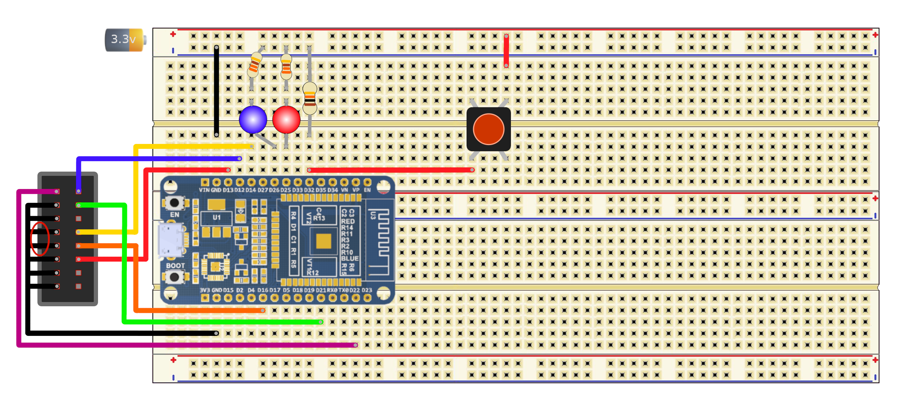
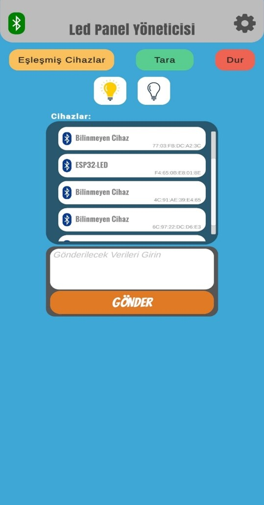
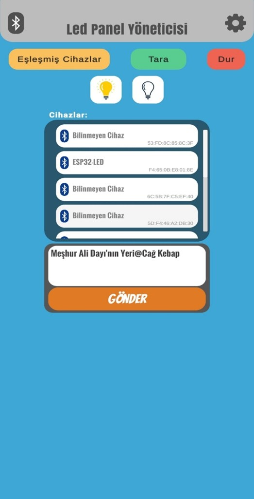
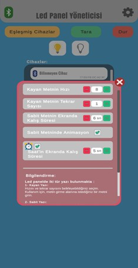
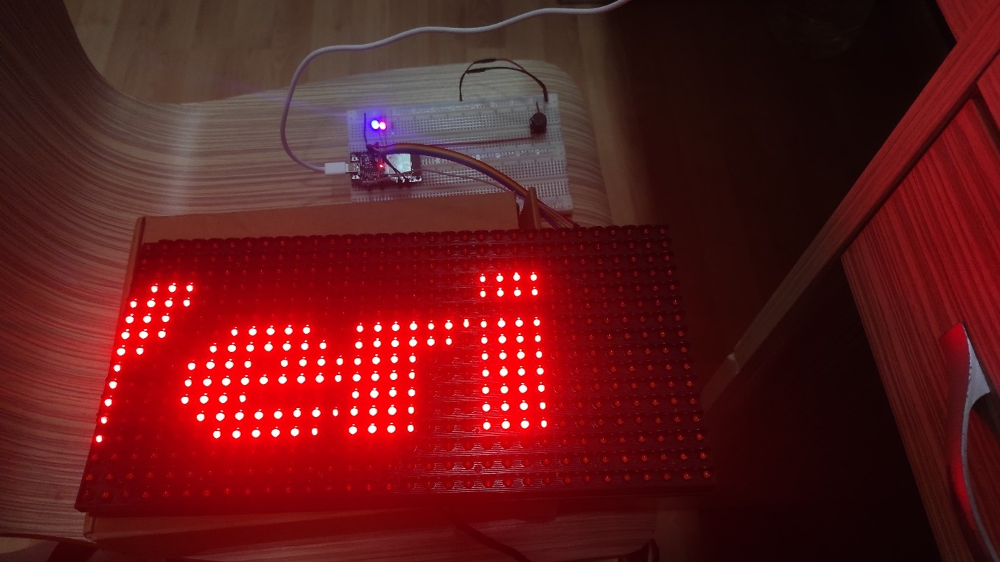
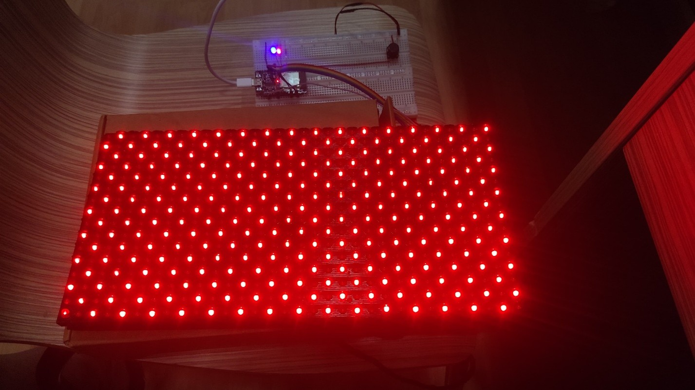
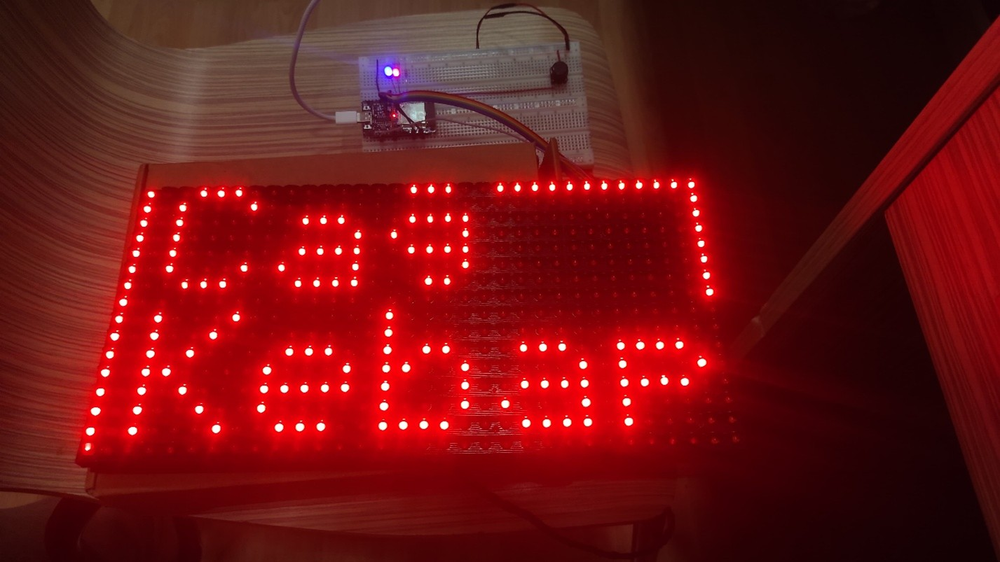
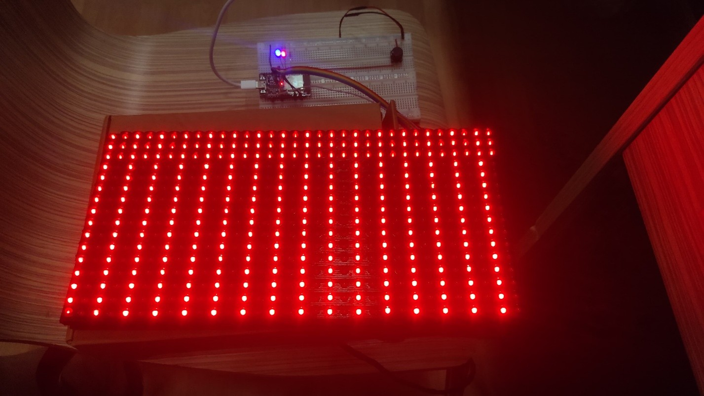
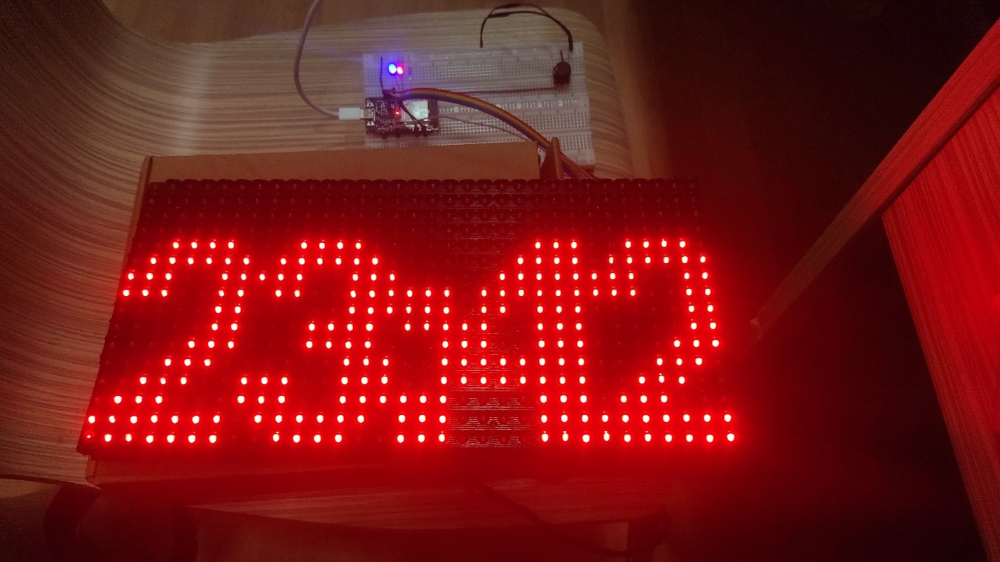

# 🔴 Unity LED Panel Control

This project is a **Bluetooth-controlled LED panel system** developed to wirelessly manage an **ESP32-based HUB12 LED panel**.  
The user interface is built with Unity, and the ESP32 directly controls the panel using an improved version of the DMD32 library.  
The system provides a customizable display experience with support for **text rendering**, **animations**, and **full Turkish character support**.

---

## 📋 Project Overview

|     Feature      |                                       Description                                        |
|------------------|------------------------------------------------------------------------------------------|
| Platforms        | Unity (interface), ESP32 (hardware)                                                      |
| Panel Type       | P10 1R (Red), HUB12 input                                                                |
| Communication    | Bluetooth (split-packet data transmission)                                               |
| Language Support | Full Turkish and English character support                                               |
| Fonts Used       | Arial_Black_16, Arial_Black_16_ISO_8859_1, SystemFont5x7 (manually upgraded for Turkish) |

---

## 🔧 Setup

### Unity Interface (Application)

1. Open the project folder with [Unity Hub](https://unity.com/).
2. A Bluetooth package from GitHub suitable for ESP32 is integrated: [BlueUnity](https://github.com/bentalebahmed/BlueUnity).  
   Refer to the package for more details.
3. You can either build the application or run the ready-made [APK](Apk/LedPanelYöneticisi.apk).

> 💡 Data is transmitted between Unity and ESP32 via Bluetooth in 7-part packets (explained below).

---

### ESP32 (Hardware)

1. Use [PlatformIO](https://platformio.org/) or Arduino IDE to upload the `main.cpp` to your ESP32.
2. The improved version of the DMD32 library is located in the `lib/` folder.
3. Font files are available in the `fonts/` folder. Custom Turkish characters have been manually added in bitmap format.

> 💡 You can open the ESP32 project directly via [PlatformIO](https://platformio.org/) using the folder `LedPanelYoneticisi_Esp32`.

#### 🧰 Required Components

+ 1 × ESP32-DEVKITC-32
+ 1 × 16x32 Red LED Panel
+ 1 × Type-C to Type-C Cable
+ 2 × Breadboard (one is not enough)
+ 20 × Male-to-Female Jumper Wires
+ 1 × 10K Resistor
+ 2 × 330 Ohm Resistors
+ 1 × Push Button
+ 1 × Red LED
+ 1 × Blue LED
+ 1 × 3.3V Battery

📷 Wiring diagram between ESP32 and the LED panel:

---

## 🔠 Font Development

Turkish characters (`ğ, Ğ, ü, Ü, ş, Ş, ı, İ, ö, Ö, ç, Ç`) that were missing in the original font files  
(`Arial_Black_16_ISO_8859_1.h`, `SystemFont5x7.h`) have been manually added in bitmap format.

---

## 📡 Bluetooth Data Packet Structure

Data is transmitted in **7 parts** using Bluetooth. Example:

Meşhur Ali Dayı'nın Yeri@Cağ Kebap@30@3@True@5@5    --> To see this, you can draw a circle on the app screen with your finger.

| Part No |                Description                |
|---------|-------------------------------------------|
| 1       | Scrolling Text                            |
| 2       | Static Text                               |
| 3       | Scrolling Speed                           |
| 4       | Scrolling Repeat Count                    |
| 5       | Enable Static Text Animation (True/False) |
| 6       | Static Text Display Duration              |
| 7       | Clock Display Duration                    |

The ESP32 parses this data and displays the appropriate animation and text on the panel.

---

## 🧪 Features Tested

- ✅ Sending text from Unity interface
- ✅ Auto reconnect after Bluetooth disconnection
- ✅ Toggle panel ON/OFF via button
- ✅ Scrolling text with Turkish character support
- ✅ Combination of scrolling text + static text + clock + animations

---

## 📸 Images

---

## 👥 Contributors

- 🤝 Based on open-source projects:
  - [BlueUnity](https://github.com/bentalebahmed/BlueUnity) – Bluetooth interface package for Unity
  - [DMD32](https://github.com/Qudor-Engineer/DMD32) – LED panel driver for ESP32

---

## 📝 License

This project is licensed under the **MIT License** – see the `LICENSE` file for details.

---

## 📌 Notes

- For Unity Android builds, remember to enable the required Bluetooth permissions.
- For more details on the Bluetooth package, visit [BlueUnity](https://github.com/bentalebahmed/BlueUnity).
- Of course there are things to fix in the app. For example: The intro animation was created by combining about 150 images in Unity, instead it can be done with a video creator app for a 25-30mb saving. Since this was my school assignment I did the first thing that came to my mind 😁

---

### 👋🏻 Good luck & happy coding!
